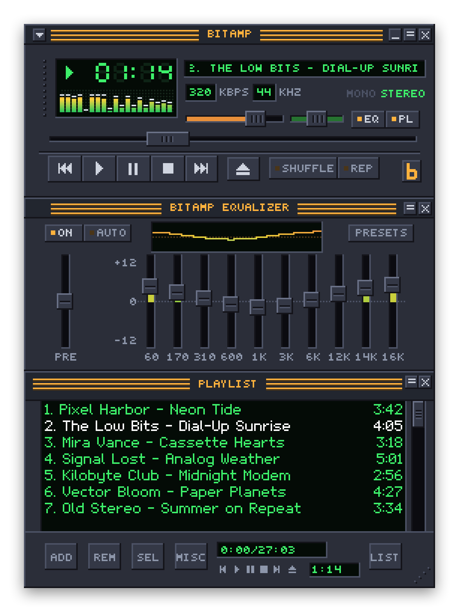
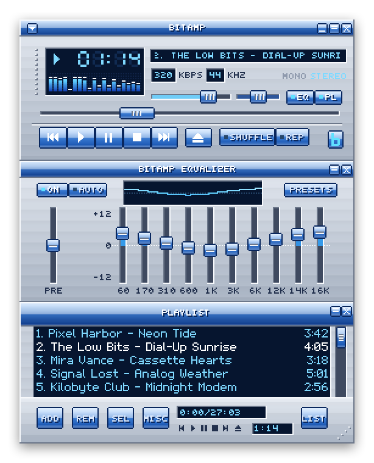
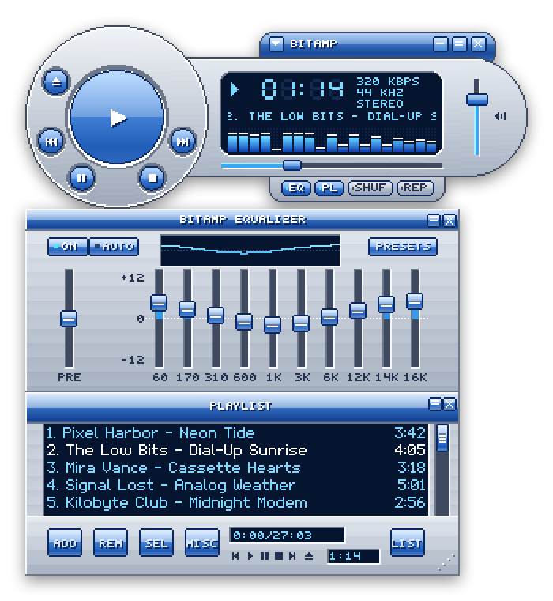
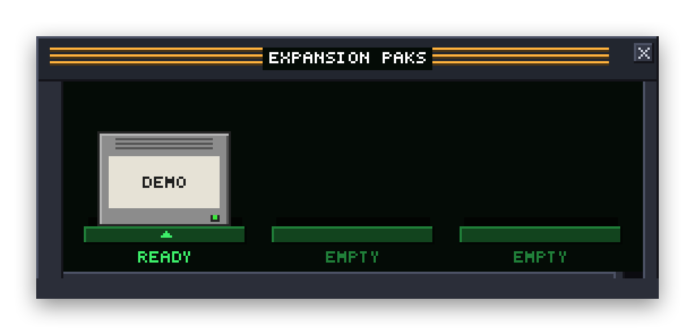

# Bitamp

[](https://github.com/ryanromanov/Bitamp/actions/workflows/ci.yml)

A small, open-source audio player for macOS with an old-school look: a tiny skinned window, a green LCD time display, a spectrum visualizer and chunky transport buttons, in the spirit of the classic desktop players from the late '90s.

> Status: early development.

Bitamp isn't affiliated with or endorsed by Winamp or Nullsoft. Its default skin is original artwork.

<p align="center">
  
</p>

<p align="center">
  
  
</p>

## Features

- Main window, 10-band equalizer and playlist, which snap together and move as a group. Window ▸ Main Window (⌥W) hides the main window and leaves the playlist, with its own little transport buttons, and Window ▸ Regroup Windows (⌥R) docks everything back into the classic stack
- Three built-in skins: Bitamp Default, the glossy Bitamp Millennium, and Bitamp Orb, whose main window drops the rectangle for a freeform shape with a big round play button. Classic `.wsz` skins work too: drop one on the window or use Skins ▸ Install Skin…. Skins ▸ Export Current Skin… saves any skin as a `.wsz` (the Orb exports as the rectangular Millennium layout).
- Shade mode for each window (double-click a title bar), and three window sizes: 1×, 1.5× and 2× (the default)
- Spectrum and oscilloscope visualizer, shuffle and repeat, `.m3u` playlists
- Retro Sound (Playback ▸ Retro Sound, or T): an 8-bit crush that plays the song as 8-bit samples, or an experimental chiptune cover that transcribes the song, follows the sung melody for the lead, and plays it on pulse, triangle and noise voices, with some of the original mixed in if you like
- [Expansion Paks](#expansion-paks): other music sources in Bitamp's playlist. Apple Music comes built in, and anyone can write more

## Expansion Paks

<p align="center">
  
</p>

An Expansion Pak adds a music source to Bitamp: a music server, a radio directory, an archive, anything with songs. Each one is a cartridge in the Expansion Paks window (Window ▸ Expansion Paks, ⌥K). Click a cartridge to search it and add songs to your playlist, next to your own files. Songs from Paks you install play like local files, with the equalizer, visualizer and Retro Sound. Click the slot under a cartridge to eject it, which switches that source off until you put it back.

**Apple Music** comes plugged in. Search your library and the whole Apple Music catalog, and mix its songs into any playlist. It needs macOS 14 or later, and an Apple Music subscription for catalog songs. Apple Music plays its songs itself, protected, so the equalizer and Retro Sound can't reach them, and they play at your Mac's volume; Bitamp dims those controls while one plays. The visualizer still moves with them on macOS 14.2 or later: the first time, macOS asks whether Bitamp may listen to other apps' audio, and Bitamp listens only to Apple Music's player.

To install a Pak, double-click its `.bitpak`, drop it on Bitamp, or use File ▸ Install Expansion Pak…. A Pak is a program, so Bitamp asks first; only install Paks from people you trust.

**Try the demo Pak.** It plays a few public-domain tunes (Ode to Joy, Für Elise, Greensleeves…) as chiptunes, made on your Mac, with a choice of waveform. Build it with `scripts/make-pak.sh` and double-click the `Demo.bitpak` it makes.

**Write your own.** A Pak is a folder with a small manifest and a program that answers a few questions in JSON: search, describe a track, and say where its audio is. Write it in Swift with the `BitampPakSDK` library in this package, or in any language. [Writing an Expansion Pak](docs/PAK-SDK.md) has everything, including a complete Pak in a few dozen lines of Python, and `Bitamp --check-pak` tries a Pak and tells you what to fix.

## Download

With [Homebrew](https://brew.sh):

```
brew install --cask ryanromanov/tap/bitamp
```

`brew upgrade` keeps it current. Or get the latest `Bitamp-x.y.z.zip` from [Releases](https://github.com/ryanromanov/Bitamp/releases). It runs on macOS 13 or later, on Apple Silicon and Intel. From version 0.4, Bitamp is signed and notarized by Apple, so it opens like any other downloaded app. Older versions aren't: the first time you open one, allow it under **System Settings → Privacy & Security → Open Anyway**.

## Build

Needs macOS 13+ and the Xcode Command Line Tools (`xcode-select --install`). The full Xcode app isn't needed.

```sh
swift build            # debug build
scripts/test.sh        # run tests (wraps swift test; see below)
scripts/bundle.sh      # release build → Bitamp.app (--universal, --version X.Y.Z)
open Bitamp.app
scripts/make-pak.sh    # the demo Expansion Pak → Demo.bitpak (--universal; works in your own Pak's package too)
.build/debug/Bitamp --check-pak Demo.bitpak   # try a Pak without installing it
```

`scripts/screenshots.sh` renders the pictures above (and `social-preview.png`, for the repository's social preview) into `docs/images` from the app's own views, with a made-up playlist.

`scripts/test.sh` works around a Command Line Tools bug: an incremental test rebuild can fail with "plugin for module 'TestingMacros' not found". The script clears stale build state and retries, falling back to a clean build.

## License

MIT. See [LICENSE](LICENSE).

The chiptune mode transcribes notes with [Basic Pitch](https://github.com/spotify/basic-pitch) by Spotify, whose model ships in `Sources/BitampKit/Resources/BasicPitch` under the Apache License 2.0; its `LICENSE` and `NOTICE` are alongside it. It follows the sung melody with [MSNet](https://github.com/bill317996/Melody-extraction-with-melodic-segnet) by Bill Hsieh, Li Su and Yi-Hsuan Yang, whose model ships, converted to Core ML, in `Sources/BitampKit/Resources/MSNet` under the MIT License, with its `LICENSE`; `Sources/BitampKit/Audio/CFP.swift` ports its feature extraction. See `scripts/msnet/README.md`.
